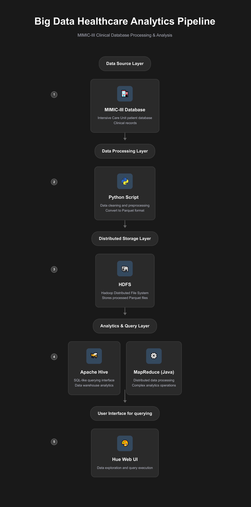

# Big Data Pipeline for MIMIC-III Clinical Data

This project sets up a big data pipeline using Docker, Hadoop, Hive, and Hue to store and query cleaned MIMIC-III clinical data in Parquet format. It also includes a MapReduce job written in Java for batch analytics.

## Directory Structure:
```
docker-hadoop-spark/
│
├── data/
│   ├── parquet/            #Parquet files used in HDFS
│   │   ├── admissions.parquet
│   │   ├── diagnosis_full.parquet
│   │   ├── icustays.parquet
│   │   └── patients.parquet
│   ├── raw/                 # Original CSV files
│   │   ├── admissions.csv
│   │   ├── d_icd_diagnoses.csv
│   │   ├── diagnoses_icd.csv
│   │   ├── icustays.csv
│   │   └── patients.csv
│   ├── mysql/
│   ├── hue/
│   └── init.sql
│
├── assets/
│   └── pipeline.png
│
├── notebooks/
│   └── clean_and_convert.ipynb  # Data cleaning + Parquet export
│
├── mapreduce/
│   ├── AverageAge.java      # Java code for MapReduce job
│   ├── average-age.jar      # Compiled JAR
│   ├── output_example.txt   # Sample output
│   ├── compile_and_run.md   # How to compile and run the job
│   └── README.md
│
├── docker-compose.yml
├── startup.sh
├── entrypoint.sh
├── hadoop.env
├── hadoop-hive.env
│
├── docs/
│   └── Big Data Project Manual.pdf
│
├── README.md
└── .gitignore
```
---

## Tools & Technologies

- Docker & Docker Compose

- Hadoop (HDFS, YARN)

- Hive + Hive Metastore (PostgreSQL or MySQL)

- Hue (Web UI for querying Hive)

- Java (MapReduce)

---

 ## Pipeline Overview

- Converted CSV files to Parquet using `clean_and_convert.ipynb`

- Used Docker Compose to spin up Hadoop + Hive services

- Copied Parquet files into HDFS

- Created Hive external tables

- Queried using Hive CLI or Hue Web UI

- Compiled and ran a MapReduce job to calculate average patient age

## Architecture Overview

##  Architecture Overview

| Component         | Description                                                                 |
|------------------|-----------------------------------------------------------------------------|
| **Docker Compose**| Used to define and manage multi-container setup for Hadoop tools           | 
| **HDFS**          | Distributed file system to store large scale Parquet data                  | 
| **Hive**          | SQL-like interface for querying structured datasets stored in HDFS         |
| **MapReduce**     | Java-based framework for parallel data processing and batch analytics      |
| **Hue Web UI**    | Browser-based interface for running Hive queries and browsing data visually|
| **MIMIC-III**     | Publicly available ICU dataset used for clinical and research analytics     |




---

## Setup Instructions

### Step 1: Install Python Dependencies
```bash
pip install pandas pyarrow
```
Note: Ensure `use_deprecated_int96_timestamps=True` to avoid Hive timestamp issues.

### Step 2: Convert Raw CSVs to Parquet in Python using Pandas and Pyarrow
```python
admissions.to_parquet(r"D:\docker-hadoop-spark\data\parquet\admissions.parquet", engine='pyarrow', index=False,use_deprecated_int96_timestamps =True)
```
Same goes for the other files

### Step 3: Start Docker-Compose Containers
```bash
docker-compose up -d
```
Make sure your in docker-hadoop-spark directory

### Step 4: Copy Parquet Files into the Namenode Container
```bash
docker cp ./data/parquet/patients.parquet namenode:/patients.parquet
docker cp ./data/parquet/admissions.parquet namenode:/admissions.parquet
docker cp ./data/parquet/icustays.parquet namenode:/icustays.parquet
docker cp ./data/parquet/diagnosis_full.parquet namenode:/diagnosis_full.parquet
```

### Step 4: Upload Parquet Files to HDFS
```bash
docker exec -it namenode bash

hdfs dfs -mkdir -p /user/hive/warehouse/{patients,admissions,icustays,diagnosis_full}
hdfs dfs -put patients.parquet /user/hive/warehouse/patients/
hdfs dfs -put admissions.parquet /user/hive/warehouse/admissions/
hdfs dfs -put icustays.parquet /user/hive/warehouse/icustays/
hdfs dfs -put diagnosis_full.parquet /user/hive/warehouse/diagnosis_full/
```

### Step 5: Create Hive External Tables
```sql
-- From inside hive-server container
docker exec -it hive-server bash
hive

CREATE DATABASE IF NOT EXISTS mimic;
USE mimic;

CREATE EXTERNAL TABLE patients (
  row_id INT,
  subject_id INT,
  gender STRING,
  dob TIMESTAMP,
  dod TIMESTAMP,
  dod_hosp TIMESTAMP,
  dod_ssn TIMESTAMP,
  expire_flag INT
)
STORED AS PARQUET
LOCATION '/user/hive/warehouse/patients/';

CREATE EXTERNAL TABLE admissions (
  row_id INT,
  subject_id INT,
  hadm_id INT,
  admittime TIMESTAMP,
  dischtime TIMESTAMP,
  deathtime TIMESTAMP,
  admission_type STRING,
  admission_location STRING,
  discharge_location STRING,
  insurance STRING,
  language STRING,
  religion STRING,
  ethnicity STRING,
  edregtime TIMESTAMP,
  edouttime TIMESTAMP,
  diagnosis STRING,
  hospital_expire_flag INT,
  has_chartevents_data INT
)
STORED AS PARQUET
LOCATION '/user/hive/warehouse/admissions/';

CREATE EXTERNAL TABLE icustays (
  row_id INT,
  subject_id INT,
  hadm_id INT,
  icustay_id INT,
  dbsource STRING,
  first_careunit STRING,
  last_careunit STRING,
  first_wardid INT,
  last_wardid INT,
  intime TIMESTAMP,
  outtime TIMESTAMP
)
STORED AS PARQUET
LOCATION '/user/hive/warehouse/icustays/';

CREATE EXTERNAL TABLE diagnosis_full (
  row_id INT,
  subject_id INT,
  hadm_id INT,
  seq_num INT,
  icd9_code STRING,
  short_title STRING,
  long_title STRING
)
STORED AS PARQUET
LOCATION '/user/hive/warehouse/admissions/';
```

## MapReduce Job:

1. Created a simplified table in Hive (patients_for_mr)
2. Exported input data for MapReduce
3. Java job created: AverageAge.java
4. Compiled with javac inside namenode, packaged as JAR
5. Ran job:
```bash
hadoop jar average-age.jar AverageAge /user/hive/warehouse/input_dir /user/hive/warehouse/output_dir
```
6. Retrieved output:
```bash
hdfs dfs -cat /user/hive/warehouse/output_dir/part-r-00000
```

---

**Detailed setup steps and project explanation and usage can be found in** [`docs/Big Data Project Manual.pdf`](docs/Big%20Data%20Project%20Manual.pdf)

---

## Data & Source Links

Based on: https://github.com/Marcel-Jan/docker-hadoop-spark

MIMIC-III Dataset: https://mimic.physionet.org/